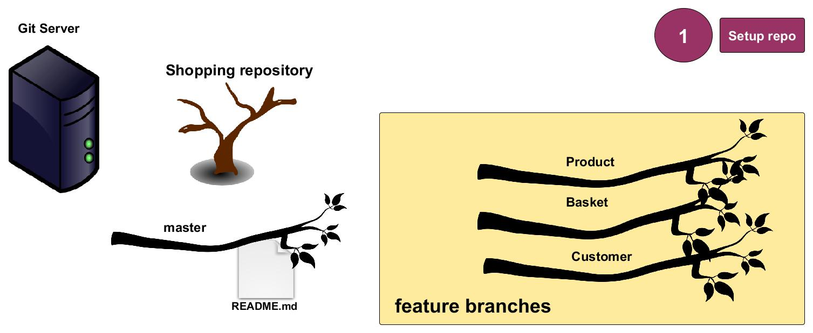
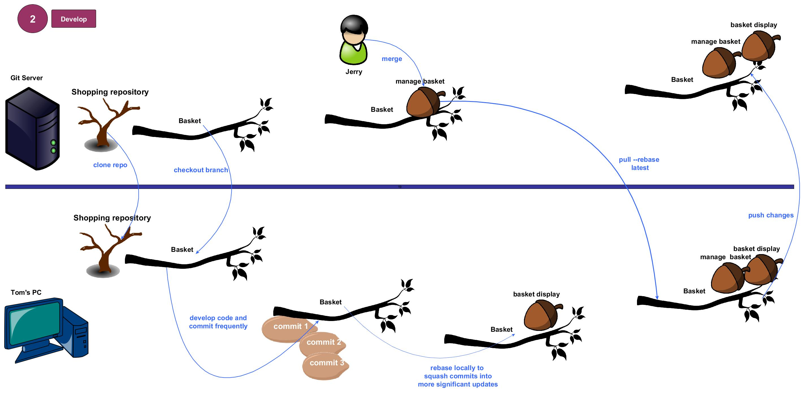

# git-work-flow

Demonstrates what happens in a typical development workflow using [Vincent Driessen's branching model.](http://nvie.com/posts/a-successful-git-branching-model/) Distinguishes between what occurs on the server and what happens on the developer's PC. Assumes a central server with a management interface like github or gitlab. Uses the example of a shopping web site.
Describes the development process in 3 stages
##1. Setup repository
Create the repository and the feature branches. Initialize the repository with a `README.md`. Everything happens on the server here.

[Full size image](https://raw.githubusercontent.com/PhilCorcoran/git-work-flow/master/images/gitflow1.jpg)
##2. Develop
Developers Tom &amp; Jerry create branches, write code and merge

[Full size image](https://raw.githubusercontent.com/PhilCorcoran/git-work-flow/master/images/gitflow2.jpg)
##3. Release
Release preparation is begun. Developers submit major bug fixes. Final production release is merged into `master` branch and tagged.

[Full size image](https://raw.githubusercontent.com/PhilCorcoran/git-work-flow/master/images/gitflow3.jpg)

## Commands
The following commands are used during the workflow. Any word enclosed in brackets &lt; &gt; is a variable such as the url of the git repository &lt;git_repo_url&gt;

| Command                                                                    | Where            | What                        |
|:---------------------------------------------------------------------------|:-----------------|-----------------------------|
| git clone &lt;git_repo_url&gt; &lt;working_branch&gt;                      | remote --> local | copy the repo               |
| git remote -v update                                                       | remote --> local | check for remote updates    |
| git status                                                                 | local            | check for local changes     |
| git merge &lt;working_branch &gt; -m &lt;merge_commit_message&gt;          | local            | merge branches              |
| git checkout &lt;branch&gt; -b &lt;new_branch&gt;                          | local            | chekout into new branch     |
| git branch -a                                                              | remote & local   | list all branches           |
| git add -A                                                                 | local            | add all files to commit     |
| git commit -m &lt;commit_message&gt;                                       | local            | commit my changes           |
| git log                                                                    | local            | check the commit log        |
| git log &lt;remote_repo&gt;/&lt;remote_branch&gt;                          | remote           | check remote commits        |
| git diff origin/&lt;branch&gt;                                             | remote & local   | check for remote changes    |
| git pull --rebase origin &lt;branch&gt;                                    | remote --> local | get the latest remote changes and apply mine on top  |
| git push origin                                                            | local--> remote  | push my changes             | 
| git tag -a &lt;release_name&gt; &lt;commit_hash&gt; -m &lt;tag_message&gt; | local            | tag a release               |
| git push origin --tags                                                     | local --> remote | push tags to remote         |
| git tag -l                                                                 | local            | list tags                   |
| git reset --hard &lt;commit_hash&gt;                                       | remote --> local | rollback to previous commit |
| git rebase -i HEAD~&lt;count_of_commits&gt;                                | local            | squash commits into a bigger update |

