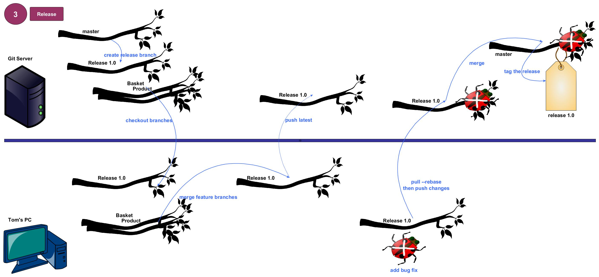

# git-work-flow

Demonstrates what happens in a typical development workflow using [Vincent Driessen's branching model.](http://nvie.com/posts/a-successful-git-branching-model/) Distinguishes between what occurs on the server and what happens on the developer's PC. Assumes a central server with a management interface like github or gitlab. Uses the example of a shopping web site.
Describes the development process in 3 stages
##1. Setup repository
Create the repository and the feature branches. Initialize the repository with a `README.md`. Everything happens on the server here.

[Full size image](https://raw.githubusercontent.com/PhilCorcoran/git-work-flow/master/images/gitflow1.jpg)
##2. Develop
Developers Tom &amp; Jerry create branches, write code and merge

[Full size image](https://raw.githubusercontent.com/PhilCorcoran/git-work-flow/master/images/gitflow2.jpg)
##3. Release
Release preparation is begun. Developers submit major bug fixes. Final production release is merged into `master` branch and tagged.

[Full size image](https://raw.githubusercontent.com/PhilCorcoran/git-work-flow/master/images/gitflow3.jpg)

## Commands
The following commands are used during the workflow. Any word prefixed with `$` is a variable such as the url of the git repository `$git_repo_url`
* git clone $git_repo_url
* git remote -v update 
* git status
* git merge $working_branch -m $merge_commit_message
* git checkout -b $working_branch_name
* git branch -rv
* git add -A
* git commit -m $commit_message
* git log #shows latest commit first
* git diff origin/$branch_name
* git pull origin $branch_name
* git push origin
* git checkout $release_branch -b $release_branch_bugs
* git tag -a $release_name $commit_hash -m $tag_comment
* git push origin --tags
* git tag -l

